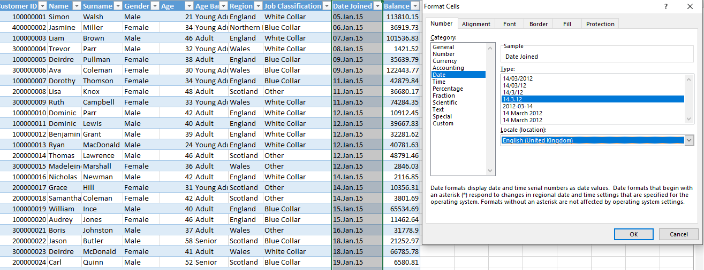
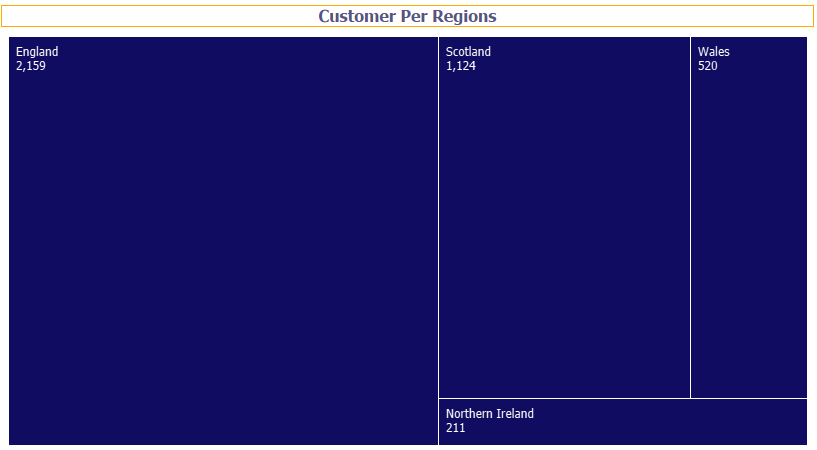
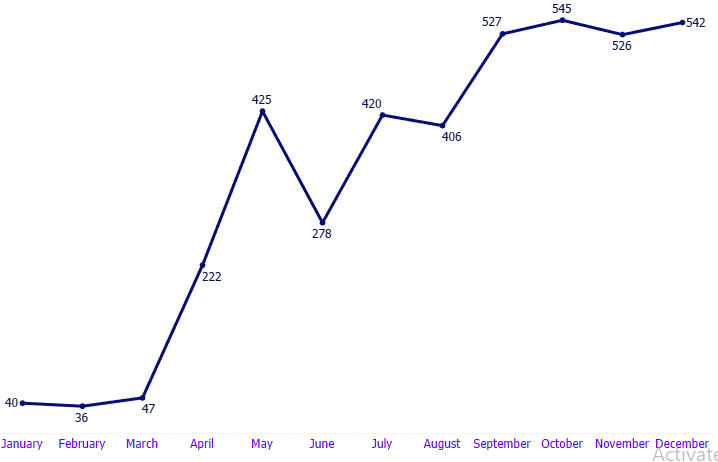
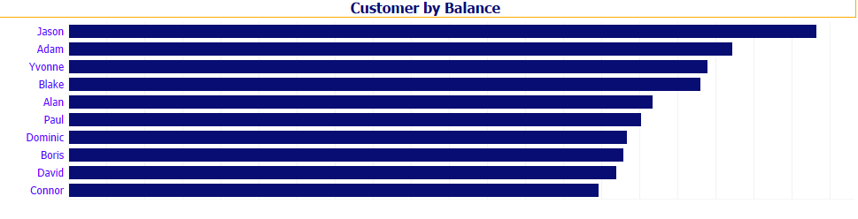
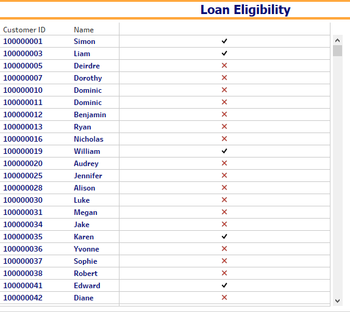

## UK-BANK-CUSTOMERS-ACTIVITIES-REPORT
- To know the activities of the UK bank customers in 2015, the number of the customers by month, the balance in there respective account, those that are eligible to access loan based on the condition set aside by the bank authority. 

## Introduction:
This project is to use the insight generated from the dataset to improve this financial institution (UK Bank) in the subsequent years,  and offering strategies,ultimately driving more business and revenue generations.

## Problem Statement;
The financial institutions (UK Bank) in there first year(2015) of operations have hereby consulted me with carrying out a quick analysis and report, because there stakeholders wishes to build an Headquater office in the location/region with the highest number of customers. They also wish to know the month in which the highest number of customers enrolled into there financial institution. And also at the opening event of the new built Headquater, the stakeholders wishes to award the Top 10 customers with the highest balance in there respective account Balance and to know the customers that are eligible to access loan from the bank in 2015.

-- After thinking critically, four questions needed an answers
1. Total Customers By Region
2. Total Customers Joined By Month 
3. Top 10 Custpmers By Balance
4. Loan Eligibility
5. Other Relivants Insight

## Data source And Tools Useed;

- Dataset was locally extracted from Excel workbook into Tableau for analysis and visualization

## Data Transformation;
### In Excel

- The dataset was gotten from Quantum Analytics NG and the dataset contains 10 column and 40414 rows.
Downloaded the dataset as csv file, then open it on Excel, then make it as a table.
- Then i had to change the column Date Jioned into English (United kingdom) format, so as to be able to work within the datetime of the location of the financial institution.

 - Then saved the dataset as an Excel file and upload it into Tableau for futher analysis and visualization.

### In Tableau

- I generated the following KPI's using calculated field
1. _Total Customers_ = count [customer_ID]
2. _Total Male Customers_ = IF[Gender] = "Male" THEN 1 ELSE 0 END
3.  _Total Female Customers_ = IF[Gender] = "Female" THEN 1 ELSE 0 END
4.  _Total Region_ = count [region]

## Explorating Data Analysis And Visualization;
1. I created my first worksheet by using a Tree maps, which shows the total customers from each regions

  

 - From this chart,we can see that England have the highest number of customers(2,159)

2. Then i created a lines chart showing the total numbers customers that enrolled into the Bank per  month.
 
     

 - From the chart, we can see that it's in the month of Octomber that the highest number of customers enrolled(545) into the Bank.

3. I then showed the Top 10 customers by Balance using horizontal bar chart
 
     

 - Jason follow by(Adam,Yvonne,Blake,Alan,Paul,Dominic,Boris,David and Connor) has the highest Balance in their respective account amongst the customers
    
  4. Then, as required by the stakeholder of the Bank couple with the set-aside conditions for loan eligibility by the management of the Bank. I used table to load all the Customer_ID, Name of the customers and created a calculate field to generate those that are eligible to access loan. Then added the shape to tick-mark those that are eligible and tick-canceled those that are not eligible
 
     

 ## Conclusion;
 
  Overall, these are the insight that can be gotten from my analysis, there are other relevant insight generated from my analysis such as;
     
  - Total Number of Region = 4.
  - Total Number of Customers = 4,014.
  - Total Number of Male Customers = 2,165.
  - Total Number of Female customers = 1,849.
  - Then Balance by Month and
  - Customers by Job Classification.
     
## Reconmendations;
  - England is the appropriate location to build the Headquater
  - The Top 10 Customers by Balance should compensated by award and considerable accessibility to multiple loan
  - The total number of customers that jioned in the bigining of the year was small compare to those that jioned towards the end of the year, therefore the stakeholders have to collaborate with the media department in order to create more awareness for those months with considerably low customers enrollment.

     Thank you
